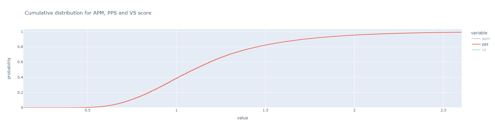

## Introduction
In this project, I set out to explore the various statistics provided by the [TETR.IO'S API](https://tetr.io/about/api/), particularly those relating to Tetra Leaugue.

## How to use this project
For those familiar with Python/Jupyter Notebook, feel free to download `tetrio-stats.ipynb`, install dependencies as necessary, and start exploring yourself! All the graphs were generated using the awesome [Plotly graphing library](https://plotly.com/graphing-libraries/) for Python, which creates interactive graphs that allows zooming, panning, and revealing information upon hovering on individual data points.

If not, you may simply choose to continue reading on, as I have summarised the findings in the following sections.

## Objectives
In this project, I set out to answer the following questions relating to Tetra League:
- What is the TR threshold for each rank in Tetrio?
- What is the actual percentile of players in each rank groups, compared to the supposed value set by Tetrio?
- How good is my APM/PPS/VS score when compared to the player population? (If you're interested in improving your stats in order to aim for a certain skill level)
- How is APM/PPS/VS scores distributed?
- How are APM/PPS/VS related with TR?
- How are APM, PPS and VS relalted with each other

## Findings
(The following results were obtained using data fetched on 2022-09-07. If you are interested in up-to-date data, you can do so by re-runing `tetrio-stats.ipynb`.)

### Background about data
Before we jump right in, let's take a moment to understand the data we are working with.

The data  was obtained by making an API call to Tetrio API's `/users/lists/league/all` route, which allows us to export the data for all players who have played Tetra League before. All in all, data on 39,477 players were analysed, including the following information about each player: 
| #  | Column      | Non-Null Count | Dtype   |
|----|-------------|----------------|---------|
| 0  | _id         | 39477 non-null | object  |
| 1  | username    | 39477 non-null | object  |
| 2  | role        | 39477 non-null | object  |
| 3  | xp          | 39477 non-null | float64 |
| 4  | gamesplayed | 39477 non-null | int64   |
| 5  | gameswon    | 39477 non-null | int64   |
| 6  | rating      | 39477 non-null | float64 |
| 7  | glicko      | 39477 non-null | float64 |
| 8  | rd          | 39477 non-null | float64 |
| 9  | rank        | 39477 non-null | object  |
| 10 | apm         | 39477 non-null | float64 |
| 11 | pps         | 39477 non-null | float64 |
| 12 | vs          | 39477 non-null | float64 |
| 13 | decaying    | 39477 non-null | bool    |
| 14 | supporter   | 3631 non-null  | float64 |
| 15 | verified    | 39477 non-null | bool    |
| 16 | country     | 38972 non-null | object  |

In this table, columns 4-13 are information pertaining to Tetra League, while the rest are general account information. 

### TR threshold and actual percentile for each rank
Tetra Leagues players are classified into 17 ranks (with X rank being the strongest and D the weakest) based on how high their TR is in relation to other players. The percentile for each rank can be found in the graphics below:

By looking at the lowest-rated player for each rank, we can find the TR threshold to get into each rank, as well as the what percentile players in each rank is, which may or may not differ with what it is supposed to be, depending on how Tetrio enforces the ranking. The results are shown in the following table. 
|  Rank  |   TR threshold |   Actual percentile |   Theoretical percentile |   # Players (Percentage) |
|--------|----------------|---------------------|--------------------------|--------------------------|
|   X    |          24604 |               98.97 |                    99.00 |              403 (1.02%) |
|   U    |          23233 |               94.71 |                    95.00 |             1603 (4.06%) |
|   SS   |          21649 |               88.83 |                    89.00 |             2337 (5.92%) |
|   S+   |          19978 |               82.38 |                    83.00 |             2376 (6.02%) |
|   S    |          18548 |               76.64 |                    77.00 |             2329 (5.90%) |
|   S-   |          16846 |               69.52 |                    70.00 |             2755 (6.98%) |
|   A+   |          14672 |               61.43 |                    62.00 |             3108 (7.87%) |
|   A    |          12646 |               53.63 |                    54.00 |             3154 (7.99%) |
|   A-   |          10508 |               45.17 |                    46.00 |             3161 (8.01%) |
|   B+   |           8589 |               37.95 |                    38.00 |             3159 (8.00%) |
|   B    |           6479 |               29.76 |                    30.00 |             3154 (7.99%) |
|   B-   |           4685 |               21.97 |                    22.00 |             3205 (8.12%) |
|   C+   |           3222 |               15.76 |                    16.00 |             2368 (6.00%) |
|   C    |           2029 |               10.01 |                    10.00 |             2334 (5.91%) |
|   C-   |           1206 |                5.04 |                     5.00 |             2027 (5.13%) |
|   D+   |            759 |                2.50 |                     2.50 |              992 (2.51%) |
|   D    |              0 |                0.00 |                     0.00 |              1011 (2.56) |

As expected, the results does not differ from the theoretical value by much, especially if we calculate the percentile values based on percentage of players instead of the position of the lowest-rated player. 

### Cumulative distribution for APM, PPS and VS score
The cumulative distribution graph for each stat shows how many players have values less than a particular value, for every value. For example, in the cumulative distribution for APM, the y-value corresponding to an APM of 40 is about 0.82, which means that a player with an APM of 40 is in the 82nd percentile, with 82% of the player having less APM than him.

1. *Cumulative distribution for APM:*

2. *Cumulative distribution for PPS:*

3. *Cumulative distribution for VS:*

#### Percentiles for APM, PPS and VS
Based on the cumulative distribution graphs, we can find the percentile values for APM, PPS and VS respectively:
|   Percentile |    APM |   PPS |   VS score |
|--------------|--------|-------|------------|
|        99.99 | 168.89 |  4.19 |     339.79 |
|        99.9  | 129.92 |  3.20 |     267.24 |
|        99.5  | 101.39 |  2.70 |     212.95 |
|        99    |  90.82 |  2.49 |     191.67 |
|        98    |  79.30 |  2.28 |     166.52 |
|        97    |  72.12 |  2.14 |     150.45 |
|        96    |  66.70 |  2.04 |     140.24 |
|        95    |  62.68 |  1.96 |     131.33 |
|        94    |  59.28 |  1.90 |     124.16 |
|        93    |  56.62 |  1.84 |     118.34 |
|        92    |  54.24 |  1.79 |     113.16 |
|        91    |  52.02 |  1.75 |     108.46 |
|        90    |  50.03 |  1.71 |     104.31 |
|        85    |  41.87 |  1.56 |      87.17 |
|        80    |  36.09 |  1.45 |      75.46 |
|        75    |  31.85 |  1.37 |      67.13 |
|        70    |  28.55 |  1.30 |      60.58 |
|        65    |  25.83 |  1.24 |      54.99 |
|        60    |  23.58 |  1.19 |      50.18 |
|        55    |  21.59 |  1.14 |      46.07 |
|        50    |  19.91 |  1.10 |      42.52 |
|        40    |  17.09 |  1.01 |      36.11 |
|        30    |  14.54 |  0.93 |      30.69 |
|        20    |  12.12 |  0.85 |      25.48 |
|        10    |   9.39 |  0.74 |      19.42 |
|         0    |   0.32 |  0.14 |       0.63 |

An interesting thing to note is how every stat increases faster the higher the percentile. For example, to get from the 10th to 20th percentile in terms of APM, we only need to increase the APM by less than 3, whereas going from 98th to 99th percentile requires more than 10 APM! This is shown graphically as the cumulative distribution curves flattening out near the top (thus, if we switched the axis to have percentile as the x-axis and APM/PPS/VS as the y-axis, we will see a sharp rise in the far right y-values)

Since some of you may be interested, I also included the percentile values for each stat corresponding to each rank's cutoff. (*Of course, being in the 99th percentile in terms of APM, PPS and VS does not guarantee that you become X rank , but it certainly is a good start ¯\\\_(ツ)\_/¯.*)
|   Percentile  |   APM |   PPS |   VS score |
|-------------- |-------|-------|------------|
|       (X) 99  | 90.82 |  2.49 |     191.67 |
|       (U) 95  | 62.68 |  1.96 |     131.33 |
|      (SS) 89  | 48.02 |  1.68 |     100.30 |
|      (S+) 83  | 39.31 |  1.51 |      82.08 |
|       (S) 77  | 33.39 |  1.40 |      70.28 |
|      (S-) 70  | 28.55 |  1.30 |      60.58 |
|      (A+) 62  | 24.43 |  1.21 |      52.08 |
|       (A) 54  | 21.23 |  1.13 |      45.28 |
|      (A-) 46  | 18.70 |  1.06 |      39.82 |
|      (B+) 38  | 16.55 |  1.00 |      35.01 |
|       (B) 30  | 14.54 |  0.93 |      30.69 |
|      (B- ) 22 | 12.62 |  0.86 |      26.48 |
|      (C+) 16  | 11.13 |  0.81 |      23.25 |
|       (C) 10  |  9.39 |  0.74 |      19.42 |
|       (C-) 5  |  7.48 |  0.67 |      15.42 |
|     (D+) 2.5  |  6.05 |  0.61 |      12.36 |
|        (D) 0  |  0.32 |  0.14 |       0.63 |

### Distribution of APM, PPS and VS

The violin plots show an estimate of how many players have a certain value for all values. For example, the wider the graph at a particular APM value, the more players have APMs close to that value. Meanwhile, the box plots show the median and lower and upper quartile for each statistic.

Interestingly, the interquartile range is pretty narrow (APM: 18.52, PPS: 0.48, VS: 39.13), with a very long tail on the right side.

### Relationship between APM/PPS/VS and TR

The scatter plots and lines of best fit (using a 5th degree polynomial fit, arbitrarly chosen) for each statistic against TR was plotted. 

As expected, the higher the TR, the higher the PPS, APM, and VS, as higher-skilled players tend to play faster. What's interesting to note is that the regression line seems to be suggest a linear relationship for lower values of TR, but starts to curve upwards after a certain points (around 20k TR). Perhaps this is due to TR being capped at 25k, so good players are stuck between 20k-25k TR, regardless of how good they actually are.

### Relationship between APS, PPS, and VS

The following graphs show the scatter plots and linear regression line for APM, PPS and VS plotted against every other statistic.

As expected, PPS, APM and VS all seem to have a strong dependency on each other, as demonstrated by the high R2 scores for their linear regression lines (0.800, 0.986, 0.808 respectively). Interestingly, the VS against APM score have a much tighther fit than VS against PPS, suggesting that the VS score calculated by Tetrio is based much more on APM than PPS. In fact, I would not be surprised if VS was calculated entirely based on APM, given how high the R2 value is between VS and APM.

### How is TR calculated

According to Tetrio, TR is calculated based on [GLIXARE](https://www.smogon.com/forums/threads/gxe-glixare-a-much-better-way-of-estimating-a-players-overall-rating-than-shoddys-cre.51169/) which "gives your chances of winning against an average player". Here, "average player" means a player that has never played before, and have the default values for their rating and rating deviation (1500 and 350 respectively). Therefore, this "average player" is more akin to a "random player" in that his skill level can be anywhere on the TR ladder. Thus, GLIXARE can also be thought of as a measure of "how likely your chances are at beating a random player on the ladder". 

Following this line of thought, if we plot each player's percentile against their TR, we expect to see a proportional relationship, as percentile should also measure how likely a player is to beat a random player (a 70th percentile player should be able to beat 70% of random players). 

Indeed, we obtain a directly proportional graph, we confirms our theory and also further reinforces how well GLIXARE estimates a player's chances of beating a random opponent.
